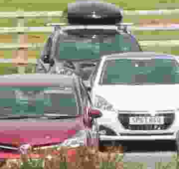
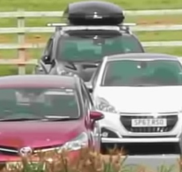
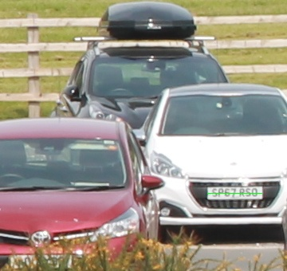

# An Elegant Algorithm for the Reduction of Blocking Artefacts in Highly Compressed Video Streams
### Terence Morley, Tim Morris, Martin Turner, The University of Manchester, UK

## Remove blocky compression artefacts:
 

## Description

This project implements our algorithm which reduces the blocking effect in highly compressed images.  It works by using multiple images of the same scene taken from slightly different viewpoints to make a single enhanced image. The different viewpoints can be obtained, for example, by causing slight camera movement between shots.

## Project Structure

* data
  * originals
    * \{original high quality images\}
  * Q5
    * \{highly compressed images\}
    * convert.sh \- *runs the python script to create the compressed images*
* output
  * process.sh \- *runs the python script to create the compressed images*
  * config.txt \- *configuration file containing the names of files to be processed*
  * IM30_1x.jpg \- *output image*
* python
  * convert_quality.py \- *python script to create the compressed images*
  * deblock_cubic.py \- *python script that implements the de-blocking algorithm*
* results
  * \{output image and original reference images for comparison\}

## Results

Original reference image is shown below.  The original images are given for comparison and are not used in the processing of the algorithm.

The image shown below is a zoomed view of the high quality reference image.

Below is a zoomed view of the highly compressed version of the reference image (JPEG quality 5).  This is cropped from one image of the set of images chosen as the image to match to.

The following image is a zoomed view of the output from the algorithm using thirty quality 5 images of the scene.  It can be seen that the compression blockiness has been reduced so much that car registration plates are now readable.  Compare this with the highly compressed image (and the others in the set) where the registration plates are not readable.

